# Basic `printf` Implementation
### How it works :

### How to import :
Simply compile our librairy from our latest source. Include our `main.h` header and link against the compiled lib/dll/a/so.

### How to use :
Our version of printf is very simple and doesn't implement flags, precision, width and length modifiers for now. But it can still be used to easily display various types of data.

`int len = _printf(const char* format, ...);`

### Supported formats : 
- [x] Characters "%c"
- [x] Strings "%s"
- [ ] Decimals "%d"
- [ ] Integers "%i"
- [ ] More...